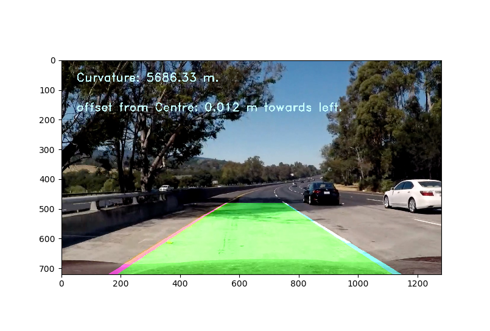
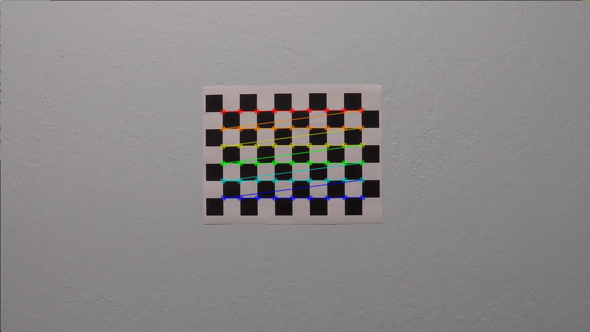
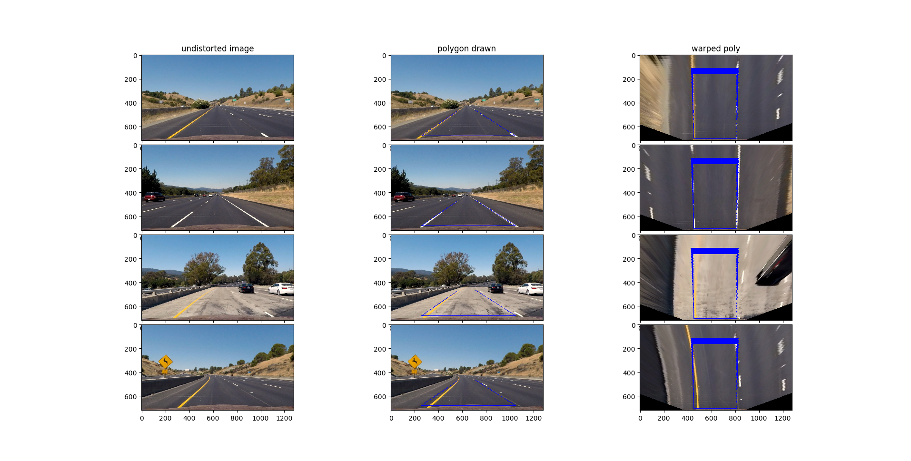
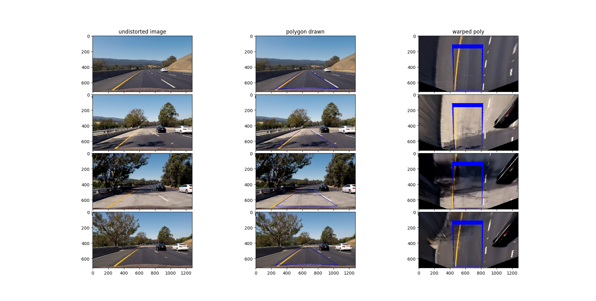
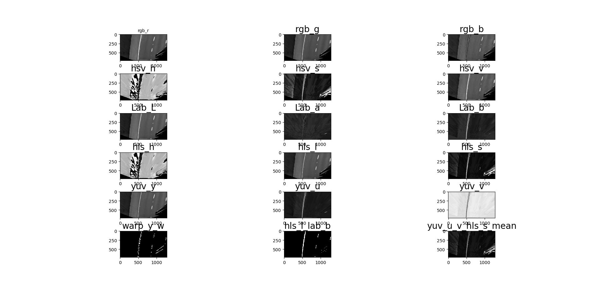
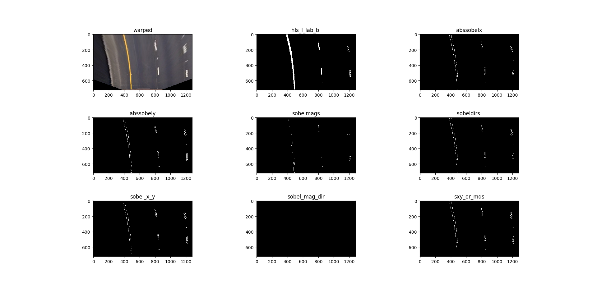
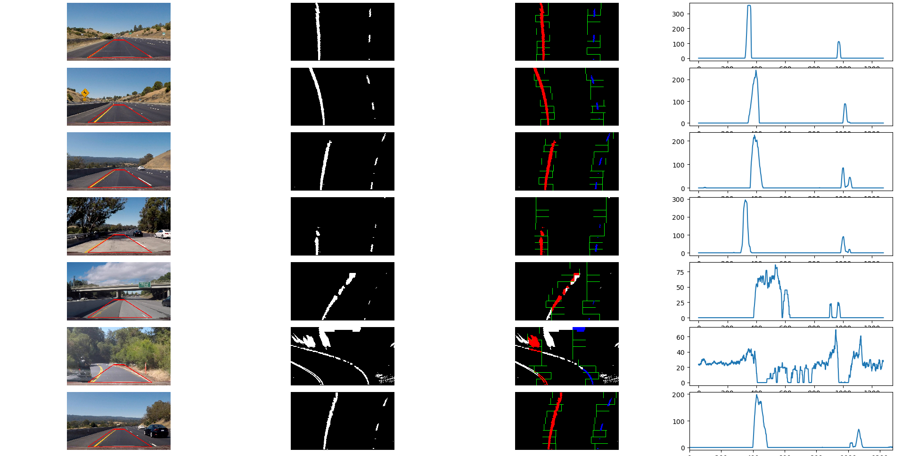
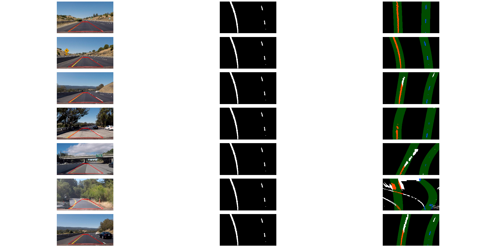
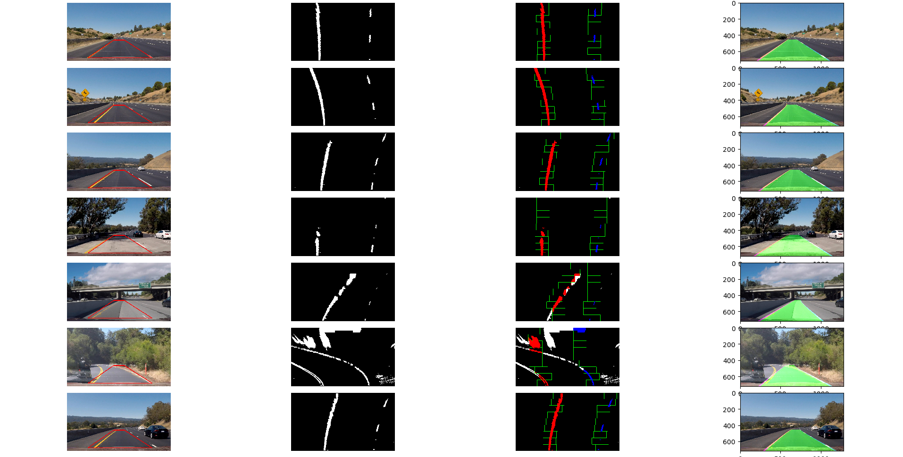

## Advanced Lane Finding

# Project Goals
---
The goals / steps of this project are the following:

* Identify Left and Right lanes using image color/gradient thresholds
* Annotate video frames with polygons depicting Lane and curvature  
* Summarize the results with a written report.

 *An image with lane lines annotated*

# Overview
---

This project is called Advance Lane Finding Project. This project has similar objectives as project 1, however, here we get to use color/gradient thresholding techniques and derive lane lines. Our goal is to find and label the lane in the video, show the radius of the curve of the lane, and show how far the vehicle is from the center of image.

The project implementation pipeline in this project consist of following steps:

1. Calibration camera and find matrix and distortion coefficients using chessboard images (provided in repo).
2. Undistort image/frames from vehicles camera.
3. Apply perspective transform to get bird's eye view of lanes (Lanes as parallel lines).
3. Use color transforms, gradients,  to create  thresholded image.
4. Use sliding scales or fir from previous frame to detect pixels that part of lanes.
5. Find and annotate (on original) image/frame with Lane's curvature and vehicle offset from center.

# Camera Calibration and Undistortion of images

Camera calibration step is important for working with images as images captured may be distorted. The method applied is based on finding corners on chessboard images using opencv function **findChessboardCorners**. Then another opencv function **calibrateCamera** is used to generate and generating calibration and undistortion matrix using.
The camera calibration code is in file: *./main_code/cam_calibration.py*

The calibration matrix is stored in file: *./camera_cal/calib_pickle.p*

Here is an example of corners found and in chessboard images

Example of undistoted image:

  
		
 A distorted image  				Undistorted image 
                

#Bird's Eye view

A perspective transform to and from "bird's eye" perspective is done to transform the image to be viewed from top.This is important for lane detection as horizontal perspective doesn't preserve parallelness of lanes. from top perspective , Bird's eye view, the lanes appear to be parallel.
perspective transform requires choosing four opoints on source image and corresponding four points on the destination image, it is important to have the points in same order.

Opencv functions getPerspectiveTransform and warpPerspective are used. warpPerspective function also returns M and Minv matrices, using Minv (inverse warp) matrix the image can be unwarped and brought to original perspective.

Here are examples of applying warp trasform:

The code for warp perspective is in file: :*./main_code/undist_warp.py*

#Color channel and Sobel Gradient Thresholding
##Color channels
RGB color space is not very useful in situations with varying light situations including  presence of shadows.Color spaces such as HSL/HSV/Lab store images based on saturation and intensities are more immune to varying lighting conditions.
 
Various color channel were tried during this project and finally a combination of L-channel from HSL and b-channel from Lab color space were used in this implementation as they are able to accurately extract yellow and white lane lines in varying conditions.
HSV s and v channel combination came close. 

Here is an example image different color spaces and the channels extracted:

The code file where properties of different channels and color spaces is tries can be found in file:*./main_code/color_thresh.py*

##Sobel Gradient
Sobel gradient function can find gradient of pixel intensity (difference) in x or y direction. using sobel output, thresholds are applied based on absolute value/magnitude value or on direction.
Here is result of sobel gradient and appying various thresholds on them:

Various sobel functions and thresholding methods are tried and can be found in file:*./main_code/soebel.py*
 
#Finding Lane Lines
Finding lane lines involves three steps and is based on warped and binary thresholded images generated in previous step:

1.At the start create a histogram (sum) of pixel in each column. The peaks in histogram would be where pixels are hot i.e. where lanes are. The image is divided into two parts for left and right lanes. A sliding window approach is used, wherein, the image is divided into  equidistant boxes along height, and starting at bottom lanes (dense pixel zones) are found and numpy polyfit function is used to find a polynomial fit for lane lines.

2.If the lanes are found in previous frame, sliding window can be avoided and assuming lane in next frame starts where it end in the previous frame the lane lines can be extrapolated. The frames are checked for lane detection and if lane is not detected in a frame, sliding window function is invoked.

3.Based on polynomial fits found in a frame, the lane area is marked and left and right lane curvature is found and annotated to the image

The code files for these steps are:
1. Sliding window approach for lane finder, along with function to draw polygons between lanes: *./main_code/sliding_window.py*
2. Nonsliding window for lane finder      : *./main_code/lane_finder_prev_fit.py*
3. Calculate radii and offset of vehicle from lane centre: *./main_code/rad_curve.py*
4. Line class to keep track of fits between frames: *./main_code/line_class.py*
5. processing pipeline : *./main_code/pipeline.py*
6. file that uses processing pipeline and applies it on project video: *./main_video/rad_curve.py*

#Submission
* Python code files are in directory main_code.**main.py** is the top python file that calls image processing pipeline with videos.

* Camera calibration matrices are in file **./camera_cal/calib.pickle**
* Directory **./output_images** has examples images from each of the steps mentioned in image processing pipeline above

#Improvements and future enhancements
I haven't been able to find a systematic method to find  corners for perspective transform. Understanding color spaces and the characteristics of the channels proved to be essential in finding image binaries. Further  application of equalization/noise reduction and adaptive thresholding can be beneficial. So, generating a robust colr/gradient method to find binary image with hotpixels for lanes is most important aspect in this project.
Further enhancements in selecting a region of interest for routes with sharp and frequent turns,advanced method for smoothening polyfits and evaluating when a fit doesn't make sense and rejecting it will be helpful to generalize the project

